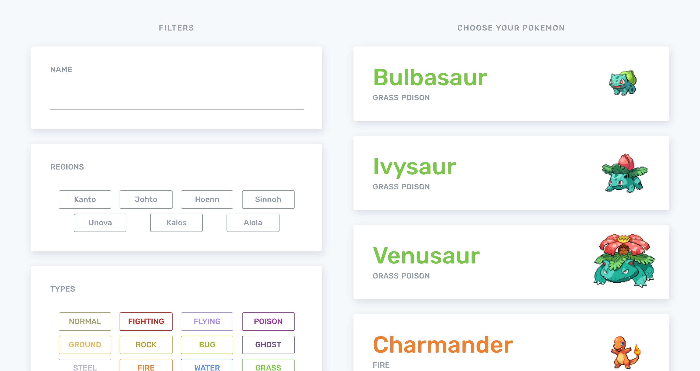

# React Pokedex

A simple pokedex based on [BrianC's design](https://dribbble.com/shots/2901787-Pokemon-OG).

This project was bootstrapped with [Create React App](https://github.com/facebook/create-react-app).

  

## Table of Contents

* [Stack](#stack)
* [Available Scripts](#available-scripts)
* [Backlog](#backlog)
* [Important Notes](#important-notes)
* [Data Structure Design](#data-structure-design)
* [Architecture Design](#architecture-design)

## Stack
  * [request](https://github.com/request/request) (simplified http requests)
  * [pokeapi](https://github.com/PokeAPI/pokeapi) (formatted pokemon data)

## Available Scripts

In the project directory, you can run:

### `npm start`

Runs the app in the development mode. 
Open [http://localhost:3000](http://localhost:3000) to view it in the browser.

The page will reload if you make edits. 
You will also see any lint errors in the console.

## Backlog

* Resource Caching (or at least better ways of structuring it)

## Important Notes

Please be aware that the api only allows for 100 calls per minute from any IP address (not counting images). It's  not a hard maximum, but be aware that requests can be blocked. If the application is not returning any results, wait a minute and then try again.

Please also note that the PokeAPI is still in the process of being updated. The data model is outdated as of generation 7 with regional variants having their own evolution lines.

**There are no defaultProps**. All passed props are required and there are no optional props. This is specified in the propTypes.

## Data Structure Design

Because this is the first time I've interacted with the pokemon dataset, I had not yet thought about how data for individual pokemon were structured. For example, an individual pokemon can have multiple forms (e.g. Alolan Ninetales and Mega Charizard). While mega evolutions can share movesets with an individual pokemon variant, regional variants can have differing movesets. Megas and variants each also have their own types (e.g. Gyrados -> Water Flying, Mega Gyrados -> Water Dark).

Because I wanted to implement the type filter, it was best to handle both megas and and regional variants under a single umbrella term, variants. Each variant has its name, typing, and can be associated with a region, making it best singular unit of data to design data structures around. Variant identifiers are stored and and then after applying filters, data of the pokemon variant can be pieced together.

## Architecture Design

The Component Tree:

* Pokedex
  * Pokefilters
    * PokefilterName
    * PokefilterType
      * Type
    * PokefilterGeneration
      * Generation
  * Pokelist
    * Pokecard
  * Pokewidget

Pokedex holds the results of a "search" with filters applied and passes the pokemon that need to be rendered to the Pokelist based on the current page number.

Pokelist creates individual cards for each pokemon and the Pokecards are each responsible for retrieving more specific data of their assigned pokemon.

Pokefilters performs the filter collection, application, and the "searching" and upon finishing, updates the results which in turn will update the lists.

If a Pokecard is selected, the data from the Pokecard is passed through Pokedex to the Pokewidget  (this reduces API calls).

To access the PokeAPI, an ES6 class named PokeAPI has been created and can be imported wherever needed. PokeAPI methods feature asynchronous callback patterns for requests. It also uses promises when multiple requests need to be issued (e.g. getting generation data or filtering with multiple types).
